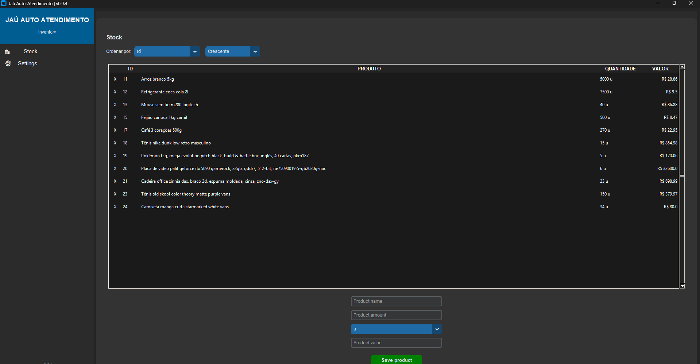

# Market Self-Service

A self-service market system made with Python.

## About

This is a personal project made for fun and learning. The goal is to practice Python, databases, GUI development, and building a larger application from scratch.

## Features

* Product management
* Inventory management
* Currency selection and conversion
* Product sorting
* SQLite database
* Dark mode

## Built With

* Python
* CustomTkinter
* SQLite
* Tkinter / ttk

## Status

This project is still in development. More features and improvements may be added over time.

## License

This project is for learning and personal use.
